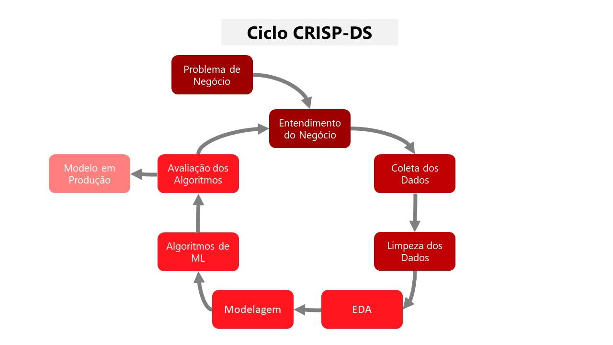
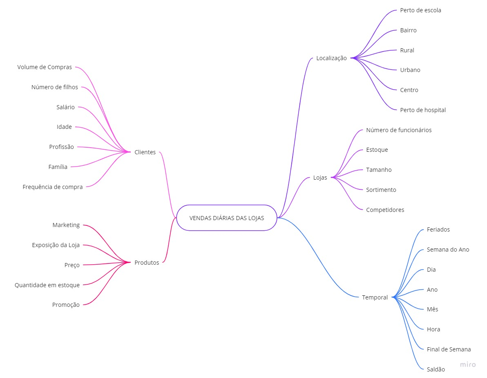
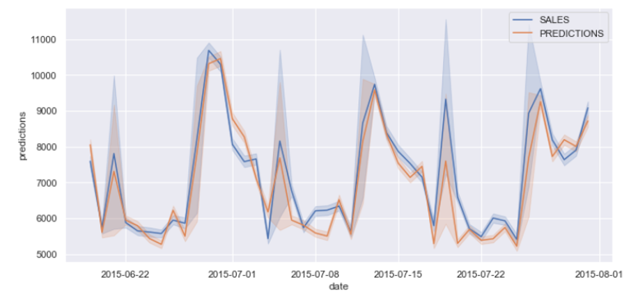
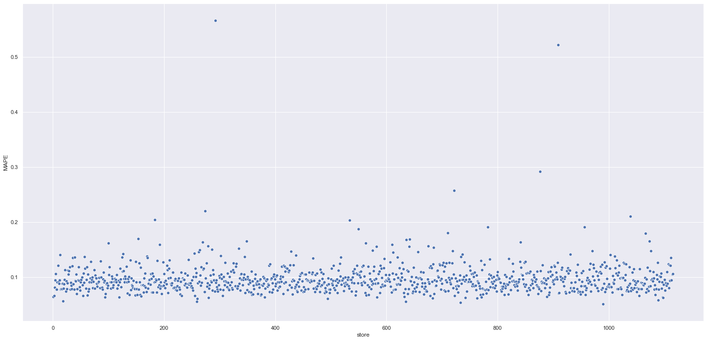
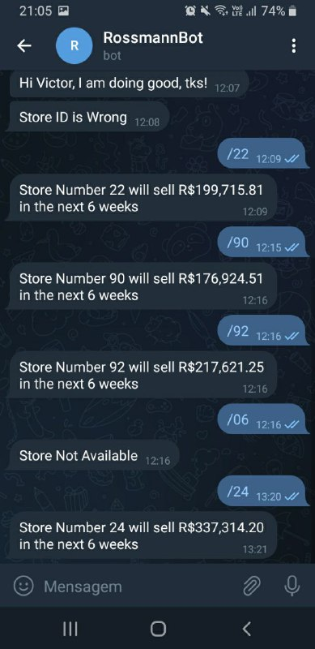

# Previsão de vendas das lojas Rossmann

# 1. Questão de negócio

A **Rossmann** é uma rede de drogarias que atua com várias lojas espalhadas pela Europa.

Surgiu a necessidade da reforma das lojas Rossmann, então, o CFO  precisa realizar o planejamento do orçamento à ser alocado para as reformas, de acordo com a receita de cada loja. Portanto, foi solicitado pelo CFO da empresa uma previsão de vendas das próximas 6 semanas.
## 1.1 Desafio

Como Cientista de Dados, o meu objetivo é responder a seguinte pergunta:

1. **Qual é o valor das vendas de cada loja nas próximas 6 semanas?**

# 2. Dataset

Para responder a pergunta do CFO, foi utilizado um *dataset* público disponível no [Kaggle](https://www.kaggle.com/c/rossmann-store-sales) com informações sobre as lojas Rossmann.

| Variável | Definição |
| --- | --- |
| Id | ID que representa um (Store, Date) tuple dentro do conjunto de teste. |
| Store |ID único para cada loja. |
| Sales | Volume de negócios em qualquer dia (isto é o que você está prevendo). |
| Customers  | Número de clientes em um determinado dia. |
| Open | Indicador para saber se a loja estava aberta: 0 = fechada, 1 = aberta. |
| StateHoliday | Indica um feriado estadual. Normalmente todas as lojas, com poucas exceções, fecham nos feriados estaduais. Observe que todas as escolas fecham nos feriados e finais de semana. a = feriado, b = feriado da Páscoa, c = Natal, 0 = Nenhum. |
| SchoolHoliday | Indica se (loja, data) foi afetado pelo fechamento de escolas públicas. |
| StoreType | Diferencia entre 4 tipos de loja diferentes: a, b, c, d. |
| Assortment | Descreve o nível de sortimento (mix de produtos): a = básico, b = extra, c = estendido. |
| CompetitionDistance | Distância em metros até a loja concorrente mais próxima. |
| CompetitionOpenSince | Fornece o ano e mês aproximados em que o concorrente mais próximo foi aberto. |
| Promo | Indica se uma loja está fazendo uma promoção naquele dia. |
| Promo2 | Promo2 é uma promoção contínua e consecutiva para algumas lojas: 0 = a loja não está participando, 1 = a loja está participando. |
| Promo2Since | Descreve o ano e a semana em que a loja começou a participar da Promo2. |
| PromoInterval | Descreve os intervalos consecutivos em que a Promo2 é iniciada, nomeando os meses em que a promoção é reiniciada. Por exemplo, "fevereiro, maio, agosto, novembro" significa que cada rodada começa em fevereiro, maio, agosto, novembro de qualquer ano para aquela loja. |

# 3. Planejamento da solução

Para solucionar o problema da Rossmann e atender o pedido do CFO, o projeto foi desenvolvido a partir da metodologia **CRISP-DS**, isto é, um método cíclico de solução de problemas de Ciência de Dados. O objetivo é entregar valor o mais rápido possível para o negócio e melhorar continuamente a solução. Para saber mais: [CRISP-DS](https://blog.magrathealabs.com/crisp-ds-cyclic-methodology-for-data-science-projects-10c7d00fbc85)

## 3.1 Processo

1. Entendimento do pedido feito pelo CFO
2. Coleta dos dados
3. Limpeza dos Dados
4. Levantamento de hipóteses sobre o comportamento do negócio
5. Análise Exploratória de Dados (EDA)
6. Preparação dos dados
7. Aplicação de algoritmos de Machine Learning
8. Mensuração do resultado do negócio
9. Colocar solução em produção

## 3.2 Ferramentas utilizadas

- Python, Pandas, Numpy, Matplotlib, Seaborn
- Anaconda, VSCode e Jupyter Notebook
- Sklearn, Boruta, XGBoost
- Heroku Cloud, Flask, Bot Telegram

# 4. Entendimento do negócio

- **Qual é o valor das vendas de cada loja nas próximas 6 semanas?**
    - **Qual é a motivação?**  
    A previsão de vendas foi requisitada pelo CFO em uma reunião mensal sobre os resultados das lojas.

    - **Qual é a causa raiz do problema?**  
    Dificuldade em determinar o orçamento/investimento necessário para reforma de cada loja.

    - **Quem é o dono do problema?**  
    Diretor Financeiro (CFO) da Rossmann.

    - **Qual é o formato da solução?**  
    **Granularidade**: Previsão de vendas por dia nas lojas para as próximas 6 semanas.  
    **Tipo de problema**: Previsão de vendas.  
    **Potenciais métodos**: Regressão e Séries temporais.  
    **Formato da entrega**:   1) Valor total de vendas de cada loja ao final da semana 6.   2) Disponibilizar a consulta da previsão via Telegram.   

# 5. Mapa mental de hipóteses

## 5.1 Top 3 insights
1. **H9: Lojas vendem mais no segundo semestre do ano**
**FALSA** Lojas vendem menos no segundo semestre do ano

2. **H10: Lojas vendem mais depois do dia 10 de cada mês**
**VERDADEIRA** Lojas vendem mais depois do dia 10 de cada mês

3. **H11:** Lojas vendem menos aos finais de semana
**VERDADEIRA** Lojas vendem menos aos finais de semana

# 6. Aplicação dos algoritmos de Machine Learning e métricas

Na etapa de Machine Learning, foi utilizado 4 algortimos diferentes: Regressão Linear, Lasso, Random Forest e XGBoost. Também foi utilizada a técnica de validação cruzada Times Series Split para o treinamento e validação dos modelos. Os resultados podem ser vistos a seguir:

* **Modelo Baseline**

| Model Name | MAE | MAPE | RMSE |
| --- | --- | --- | --- |
| Average Model | 1354.8 | 0.45 | 1835.1 |

* **Modelos de ML** (média +/- desvio padrão)

| Model Name | MAE CV | MAPE CV | RMSE CV |
| --- | --- | --- | --- |
| Random Forest | 837.68 +/- 219.1 | 0.12 +/- 0.02 | 1256.08 +/- 320.36 |
| XGBoost | 1039.91 +/- 186.68 | 0.14 +/- 0.02 | 1496.16 +/- 258.53 |
| Linear Regression | 2081.73 +/- 295.63 | 0.3 +/- 0.02 | 2952.52 +/- 468.37 |
| Lasso | 2116.38 +/- 341.5 | 0.29 +/- 0.01 | 3057.75 +/- 504.26 |

O modelo de Regressão Linear e Lasso tiveram resultados ruins e não conseguiram superar o modelo baseline, ou seja, o conjunto de variáveis não se adequa bem aos modelos lineares.

O algoritmo Random Forest teve o melhor resultado segundo as métricas, mas o modelo XGBoost tem um resultado bem próximo.

Mesmo que a Random Forest teve um resultado melhor, foi escolhido o modelo XGBoost para seguir para a etapa de otimização dos hiperparâmetros. Essa escolha foi motivada pelas seguintes razões:
* O modelo será hospedado no Heroku (free), portanto, existe limite de capacidade de memória. O tamanho de memória de um modelo Random Forest é muito maior que um XGBoost
* O modelo XGBoost é performático e pode ser melhorado na etapa de otimização dos hiperparâmetros, ficando com as métricas próximas da Random Forest

### **Resultado após a otimização dos hiperparâmetros utilizando RandomSearch:**
| Model Name | MAE | MAPE | RMSE |
| --- | --- | --- | --- |
| XGBoost Tuned | 662.4 | 0.096 | 957.1 |

Resultado melhor do que a Random Forest! :)

# 7. Resultados do negócio
Traduzindo as métricas do modelo em métricas de negócio, podemos entender o quanto de dinheiro está em jogo. Abaixo está a tabela com a predição dos cenários e gráfico do Real x Previsto:

| Scenario | Total |
| --- | --- |
| Predictions | R$ 284,278,758.25 |
| Worst Scenario | R$ 283,536,191.58 |
| Best Scenario | R$ 285,021,324.92 |

Gráfico: Vendas Real x Vendas Previsto

O modelo tem uma ótima performance, erra na média 10% do valor real. Porém, existem lojas que são mais difíceis de prever e ficam longe do valor real. Esses casos, pontos mais dispersos, podem ser vistos no gráfico abaixo:

Gráfico: Scatterplot - Erro previsão MAPE

# 8. API Rossmann e Bot Telegram

## 8.1 API 
Foi desenvolvida uma API para colocar o modelo em Produção. Esta API está disponível no servidor do [Heroku](https://rossmann-pred-vbras.herokuapp.com/rossmann/predict).

## 8.2 Bot Telegram
Para disponibilizar a consulta da previsão das lojas, foi criado um Bot no Telegram que responde qual o valor de vendas das próximas 6 semanas da loja especificada. Basta enviar o número da loja que se deseja saber a previsão. [RossmannBot](https://t.me/rossmann_sales_bot)

# 9. Próximos passos
Este foi o primeiro ciclo do método CRISP-DS para o problema da Rossmann, foi possível passar por todas as etapas de um projeto completo de Ciência de Dados e entregar valor ao negócio. 

* O que pode ser feito no próximo ciclo?
    - 
- Treinar outro modelos de Machine Learning, como Time Series
- Construir e coletar mais variáveis para a modelagem
- Construir um pipeline para retreinar o modelo
- Melhorar as visualizações de dados
# 10. Referências

- Este projeto é um desafio da [Comunidade DS](https://www.comunidadedatascience.com/ds-em-producao/).
- O conjunto de dados foi coletado no [Kaggle](https://www.kaggle.com/harlfoxem/housesalespredictionhttps://www.kaggle.com/c/rossmann-store-sales).

